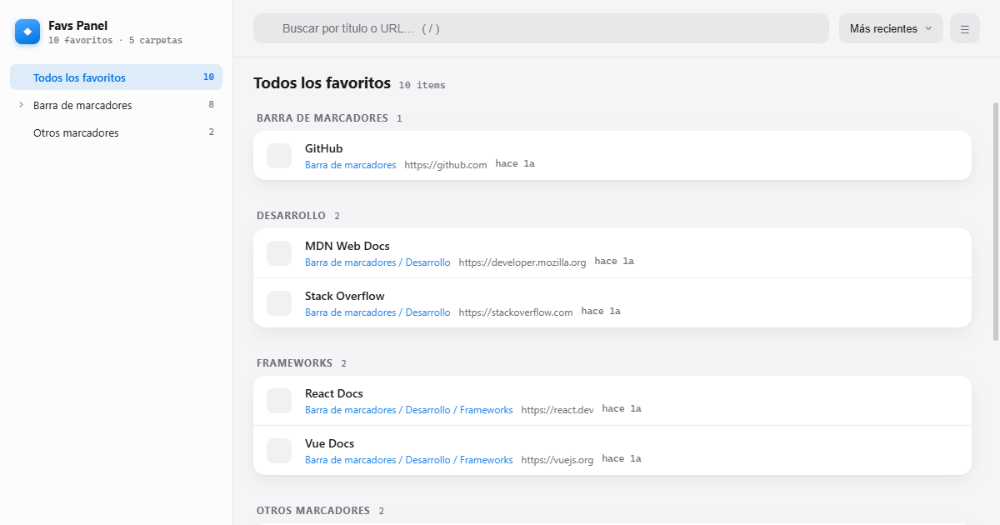

# Favs Panel

Un gestor de favoritos para Chrome con estilo iOS/iCloud: reemplaza el popup nativo por un panel completo, con tus favoritos agrupados por carpeta, búsqueda instantánea y todos los metadatos a la vista.

## ✨ Características

- **Organización por secciones** — los favoritos se agrupan automáticamente por carpeta (y subcarpeta), no una lista plana interminable.
- **Árbol de carpetas** en la barra lateral, con conteo de favoritos por carpeta.
- **Búsqueda instantánea** por título o URL (atajo `/`).
- **Ordenamiento** por fecha, alfabético o por dominio.
- **Vista compacta** para ver más favoritos en pantalla.
- **Acciones rápidas**: abrir, copiar URL o eliminar sin salir del panel.
- **Diseño estilo iOS/iCloud** — tipografía del sistema, vidrio esmerilado, grouped lists y acento azul.
- 100% local: usa la API de `chrome.bookmarks`, no se envían datos a ningún servidor.

## 🚀 Instalación

Todavía no está publicada en la Chrome Web Store. Para probarla:

1. Cloná este repo o descargalo como ZIP.
2. Abrí `chrome://extensions` en Chrome (o cualquier navegador basado en Chromium).
3. Activá el **Modo desarrollador** (arriba a la derecha).
4. Hacé clic en **Cargar descomprimida** y seleccioná esta carpeta.
5. Abrí el panel con el ícono de la extensión o con el atajo `Alt+B`.

## 🛠️ Stack

Vanilla JS + HTML + CSS, sin frameworks ni build step. Manifest V3.

## 📄 Permisos

- `bookmarks` — leer y gestionar tus favoritos.
- `favicon` — mostrar el ícono de cada sitio.

Ningún dato sale de tu navegador.
